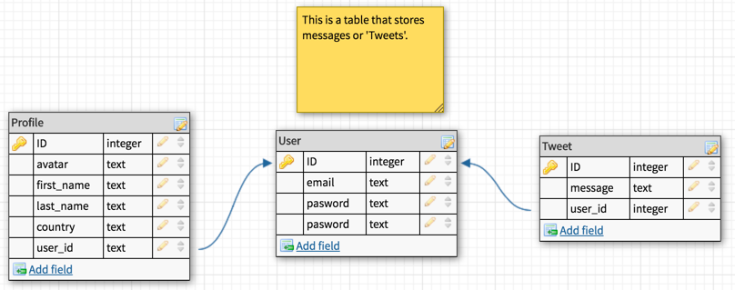

# README

# User stores
***

# Database (DB)
## ERD (Entity Relationship Diagram)

# DB tables
I made 3 tables for my app, User, Tweet and profile. User stores the user information like password etc. Tweet stores the information messages that a user tweets and the Profile table stores the information about the user. Each user has one profile and many Tweets.

## user
    - email
    - password

## Profile
    - avatar
    - first_name
    - last_name
    - country
    - user_id (belongs_to)

## Tweet
    - message
    - user_id (belongs_to)

## Pages
## homepage
    - tweets on page
    - long in / log out

## twet show page
    - see tweet
    - edit tweet (if logged in)

## profile page
    - first_name, last_name
    - tweet count
    - avatar
    - country
    - edit ability

## figma

